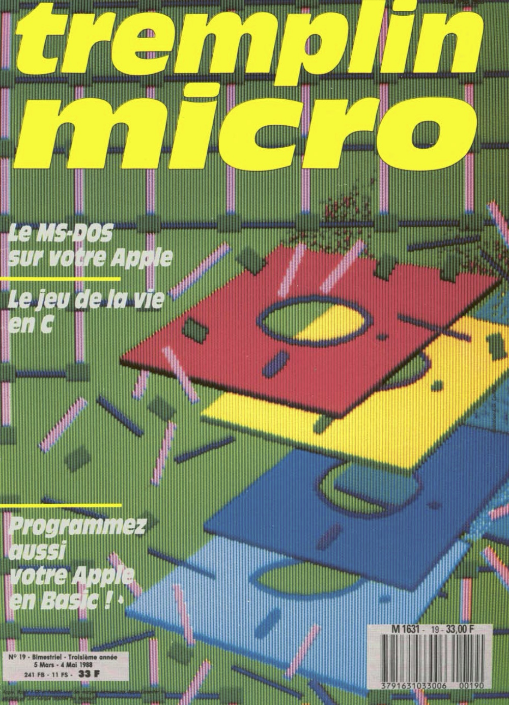
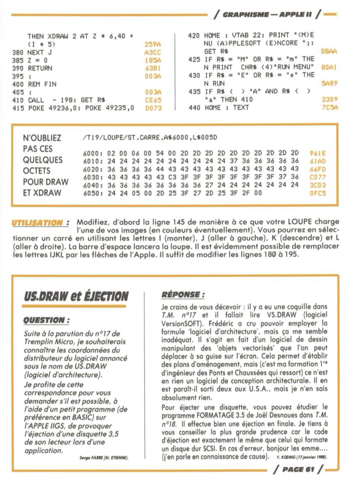

## Ten Years Reproducibility Challenge

This is a reproduction of N. P. Rougier. “LOUPE.” In: Tremplin Micro 19
(Mar. 1988), pp. 60–61 for the [Ten Years Reproducibility
Challenge](https://rescience.github.io/ten-years/).

To run the program, you will need an apple //e emulator (for example [Virtual
II](http://www.virtualii.com/), [MAME](https://www.mamedev.org/) or [Apple
//jse]( https://www.scullinsteel.com/apple/e)), load the
[challenge.dsk](challenge.dsk) and boot it. Then follow instruxtion

* Reproduction article: [article.pdf](article/article.pdf)
* Reproduction floppy: [challenge.dsk](challenge.dsk)
* Original article: [Tremplin Micro 19 magazine](https://archive.org/details/tremplin_micro_newsletter_issue_19)
* Original floppy: [Tremplin Micro 19 floppy](https://mirrors.apple2.org.za/ftp.apple.asimov.net/images/non-english/french/tremplinmicro/tremplinmicro_19_disks.zip)

----

