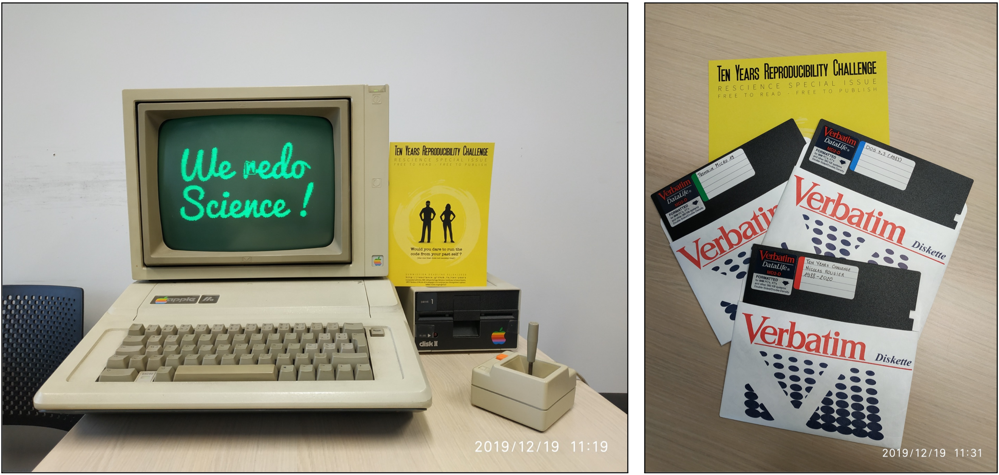

## Ten Years Reproducibility Challenge

This is a reproduction of the article "N. P. Rougier, LOUPE, Tremplin Micro 19
(Mar. 1988), pp. 60–61" for the [Ten Years Reproducibility
Challenge](https://rescience.github.io/ten-years/).

---

I published my very first (non-scientific) article in a French Magazine named
"Tremplin Micro" in 1988, 32 years ago. It was a program written in Applesoft
Basic that zoomed out a 21x21 pixels area of an image by a factor 4 (not very
impressive by 2020 standards). As written in the original "cover" letter I
sent, the zoom was also very slow. At that time, I was learning 6502 assembler
but I was not proficient enough to write the program using it. Thirty-two years
might appear a relatively small lapse of time compared to Human history, but
for digital computer history, this is actually huge, almost half of its
history. Imagine that the Apple //e was using a 6502 microprocessor with a
8-bits data bus, had 64Ko of RAM and the speed was barely 1Mhz. The text modes
were 40 or 80 columns, and the video modes include a standard graphic mode
(140x96 pixels, 16 colors) or an impressive high-resolution mode (280x192
pixels, 6 colors). Despite these apparent limitations, the Apple //e has been a
very popular machine complemented by an extended software library. For the Ten
Years Reproducibility Challenge, I thus decided to try to re-run the original
program, just for the sake of checking if I could. This includes finding the
sources (in a usable form), remembering how to load and start a program in
Applesoft, producing some original data (image) to test the program, and of
course, checking if it was running as expected.

**→ Read the rest of the article from** [article/article.pdf](article/article.pdf)  
**→ Original article:** [Tremplin Micro 19 magazine](https://archive.org/details/tremplin_micro_newsletter_issue_19)  
**→ Original floppy:** [Tremplin Micro 19 floppy](https://mirrors.apple2.org.za/ftp.apple.asimov.net/images/non-english/french/tremplinmicro/tremplinmicro_19_disks.zip)

To run the program, you will need an apple //e emulator (for example [Virtual
II](http://www.virtualii.com/), [MAME](https://www.mamedev.org/) or [Apple
//jse]( https://www.scullinsteel.com/apple/e)), load the
[challenge.dsk](challenge.dsk) and boot it. Then follow instruxtion

